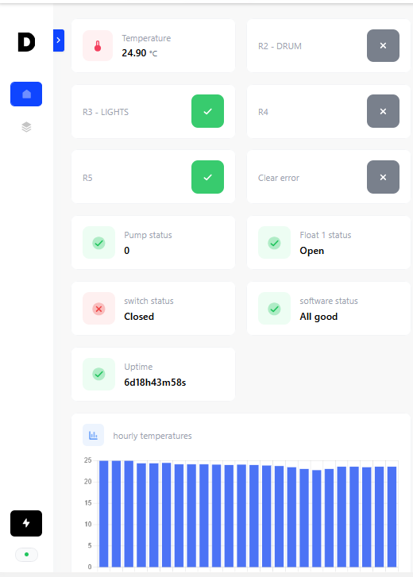

# Pond Monitor v1.0

PCB and software to control a pond system from a web interface (filters, pump, drums, lights, ...) and provide some useful data charts (water dirtyness, temperature).
The pond's filter is a gravity filter, which means that the pump is inside the filter and pushing out water to the pond. (context for technical details below)

## Hardware

- ESP 32S module board as MCU
- Inputs
    - 3 terminal blocks to connect water floats (or any switch).
        - One terminal is not connected to the MCU but goes through a RS latch. It's meant to be used as a security to avoid the main pump to run without water, which can happen if the filter is clogged or the pond water level too low or the pump throughput is too high. So if the MCU goes crazy/shuts down for some reason (first time using EPS32 for a serious project), the latch is still able to stop the pump.
        - All the floats are connected to the MCU.

    - One terminal block for power supply (12V)
    - One terminal block for sensors (1 data wire sensors)

- Outputs:
    - 5 terminal blocks to drive 12V relays.
        - One is reserved to control the main pump, from the latched signal.
        - The other 4 are controlled by the MCU

- DCDC buck to get 5V supply for the sensor and for the MCU board.
- Open drain level shifter for the sensor (5 - 3.3V)
- An RS latch for pump security. Possibility to use one channel for other purpose (solder jumper)

## Software

- Using arduino framework for ESP32
- [ESP-Dash](https://github.com/ayushsharma82/ESP-DASH) interface to see the float and relay status, temperature charts (day - month - year), drum activation charts, error reporting. Control relays for drum, lights, or whatever you want.
- Connects to Wifi.
- Current behaviour or float1 and relay2: when float2 closes, the relay2 is activated for a determined period of time (1 rotation of the drum).
- Current behaviour of float2 and relay3: plug any SPST toggle switch to the input and some light to the output. You can control light physically or remotely.
- Other relays are spare and can be controlled by software.
- All the preconfigured behaviours are for my use-case but are made to be easily extendable and configurable.

Here is how it looks like:

### Known issues and solutions of v1.0
- All transistors have to be soldered 120° anti-clockwise because I forgot to update the default KiCad footprint and pin assignation. (no wire needed and no need to bend any pin)
- Don't solder the R11 resistor, it breaks the boot process when flashing firmwares.